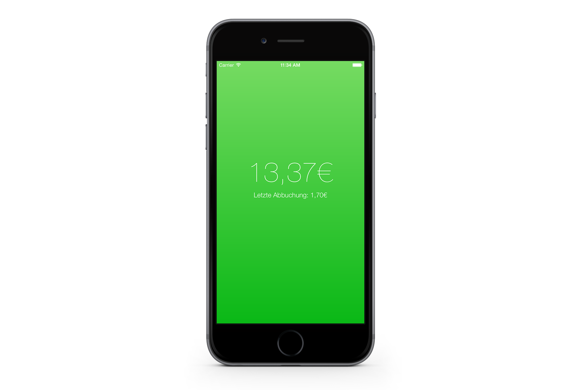

## Emeal

This is an iOS app for reading the current balance of your TU Dresden Emeal card. It's inspired by the Android app [MensaGuthaben](https://github.com/jakobwenzel/MensaGuthaben).

### But how?!

You're thinking this can't work, as there's no way for developers to access the NFC hardware in an iPhone. And you're completely right, this doesn't work. And that's a shame. But here's me hoping that Apple will be doing the same thing with NFC that they did with TouchID. Put the necessary tech into their devices and open up the APIs with the next iOS version. Maybe we're lucky and this will happen. If it does, I'll do my best to implement it into this app. If not, this will just go away and die and I'll be sad :(
